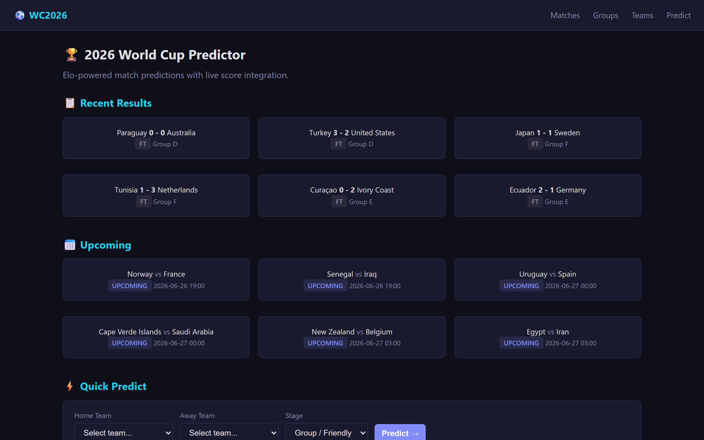
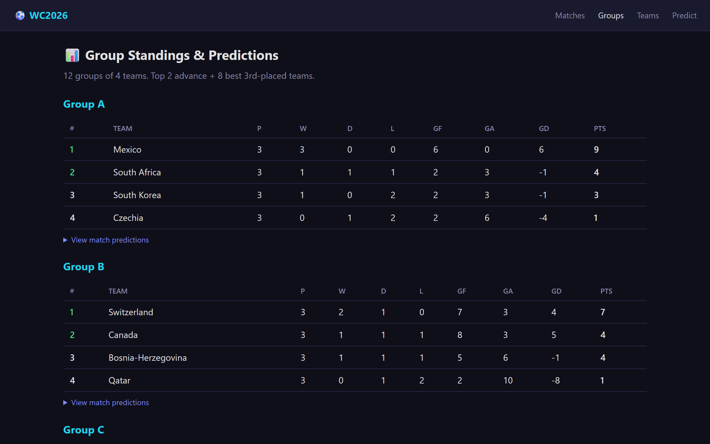
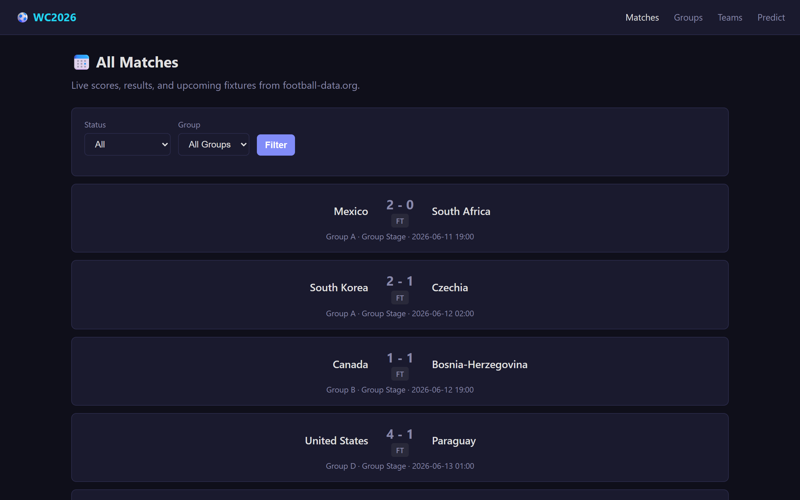
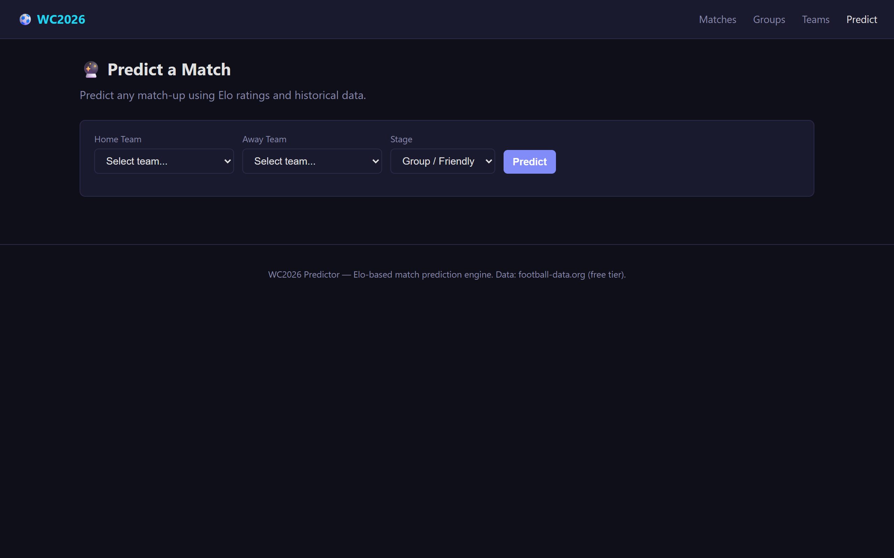
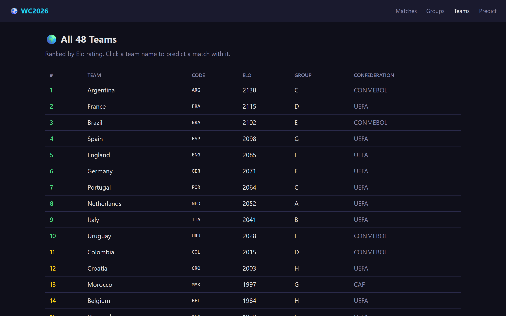

# WC2026 — 2026 FIFA World Cup Match Predictor

## Project Screenshots







Predict match outcomes for the 2026 FIFA World Cup using real historical data and an Elo-based statistical model. Includes live score integration via a free football API and a built-in web UI.

## Quick Start

```bash
# Install in development mode (recommended)
pip install -e .

# Or install dependencies only
pip install -r requirements.txt

# Predict a single match
python -m wc2026 predict "Argentina" "France"

# Predict with knockout-stage modifier
python -m wc2026 predict "Brazil" "Germany" --stage semifinal

# Predict all group-stage matches for a group
python -m wc2026 group A

# See all 48 teams ranked by Elo
python -m wc2026 teams

# Run a full tournament simulation
python -m wc2026 simulate

# View a team's World Cup history
python -m wc2026 stats "Argentina"

# Fetch live scores (requires API key — see below)
python -m wc2026 live

# Launch the web UI
python -m wc2026 web
```

## Live Scores (via football-data.org)

The `live` command fetches real-time World Cup match data from [football-data.org](https://www.football-data.org/), a free football API.

### Setup

1. Get a free API key at [football-data.org](https://www.football-data.org/client/register)
2. Set it as an environment variable:
   ```bash
   export FOOTBALL_DATA_API_KEY="your-api-key-here"
   ```
   Or create a `.env` file in the project root:
   ```
   FOOTBALL_DATA_API_KEY=your-api-key-here
   ```

### Usage

```bash
# Live scores (all matches)
python -m wc2026 live

# Only live matches
python -m wc2026 live --status LIVE

# Finished matches with results
python -m wc2026 live --status FINISHED

# Filter by group
python -m wc2026 live --group A

# Compact banner only (no detailed match cards)
python -m wc2026 live --compact
```

### How It Works

- Fetches match data via `GET /v4/competitions/WC/matches` and group standings via `GET /v4/competitions/WC/standings`
- Caches responses for 60 seconds to stay within the free tier limit (10 requests/minute)
- Falls back to stale cache if the API is unreachable
- Compares live results against Elo predictions when matches are finished

## Web UI

Launch a local web server with a full UI for browsing matches, groups, teams, and predictions.

```bash
# Start on default port 8080
python -m wc2026 web

# Custom host and port
python -m wc2026 web --host 0.0.0.0 --port 3000
```

Then open **http://localhost:8080** in your browser.

### Pages

| Route | Description |
|-------|-------------|
| `/` | Dashboard — live scores, upcoming matches, quick predict form |
| `/matches` | All matches with status/group filters |
| `/match/<id>` | Match detail — prediction vs actual result comparison |
| `/groups` | Group standings with team rankings and match predictions |
| `/teams` | All 48 teams ranked by Elo rating |
| `/predict` | Match prediction form with probability bars |

### JSON API

The web server also exposes REST endpoints for programmatic use:

| Endpoint | Description |
|----------|-------------|
| `GET /api/predict?home=X&away=Y&stage=Z` | Match prediction |
| `GET /api/teams` | All teams with Elo ratings |
| `GET /api/team/<name>` | Single team details |
| `GET /api/group/<letter>` | Group data with predictions |
| `GET /api/live` | Live scores (requires API key) |
| `GET /api/standings` | Group standings (requires API key) |

## How It Works

### Elo Rating System

Win probability is calculated using the standard Elo formula:

$$P(A \text{ wins}) = \frac{1}{1 + 10^{(R_B - R_A) / 400}}$$

Where $R_A$ and $R_B$ are the Elo ratings of teams A and B.

### Draw Probability

Draw probability is modeled with a Gaussian decay function centered on equal ratings. Close matchups have a ~30% draw chance; as the rating gap widens, the draw probability drops to a floor of ~5%.

### Adjustments

| Factor | Effect |
|--------|--------|
| Home advantage | +50 Elo points to the first-named team |
| Knockout stage | 35% reduction in draw probability (extra time + penalties) |
| Confidence | Three tiers based on Elo gap: low (<40), medium (<120), high (120+) |

## Tournament Simulation

The `simulate` command runs a full 48-team tournament:
1. **Group Stage** — 12 groups of 4, round-robin. Top 2 from each group advance (24 teams).
2. **Round of 32** — 8 best 3rd-placed teams join. Seeded by Elo (1st vs 32nd, 2nd vs 31st...).
3. **Knockout** — Round of 16 → Quarterfinals → Semifinals → Final + 3rd Place Match.

Each match is decided by rolling against the predicted probabilities with a scoreline simulated via a Poisson-inspired model.

## Data

This project includes **real reference data**:

| File | Contents |
|------|----------|
| `data/teams.json` | 48 teams with FIFA codes, confederations, and group assignments |
| `data/elo_ratings.json` | Current Elo ratings for all 48 qualified teams |
| `data/historical_matches.json` | 172 real World Cup matches from every tournament (1930–2022) |

## Architecture

```
wc2026/
├── cli.py            # argparse CLI with 7 subcommands (predict, group,
│                     #   teams, simulate, stats, live, web)
├── models.py         # Team, Match, Prediction dataclasses
├── data.py           # JSON data loader with cross-referencing
├── predictor.py      # Elo-based prediction engine
├── display.py        # Formatted terminal output with ANSI colors + live score cards
├── score_fetcher.py  # Live score API client (football-data.org)
├── web_server.py     # FastAPI web app with Jinja2 templates
└── templates/        # HTML templates for web UI
    ├── base.html     # Layout shell with navigation
    ├── index.html    # Dashboard with live scores
    ├── matches.html  # Match list with filters
    ├── match_detail.html  # Single match: prediction vs actual
    ├── groups.html   # Group standings with predictions
    ├── teams.html    # Full team rankings table
    └── predict.html  # Match prediction form

data/
├── teams.json
├── elo_ratings.json
├── historical_matches.json
└── live_cache*.json  # Cached API responses (gitignored)

tests/
├── test_models.py
├── test_predictor.py
├── test_data.py
└── test_score_fetcher.py
```

## Predictions in Action

```
┌──────────────────────────────────────────────────────────┐
│  Argentina vs France                                     │
│  Elo: 2138 — 2115                                        │
│                                                          │
│  Argentina      ███████████████████░░░░░░░░░░░░░░ 48.7%  │
│  Draw           ████████░░░░░░░░░░░░░░░░░░░░░░░░ 19.4%  │
│  France         █████████████░░░░░░░░░░░░░░░░░░░ 32.0%  │
│                                                          │
│  Prediction: Argentina                                   │
│  Confidence: LOW                                         │
└──────────────────────────────────────────────────────────┘
```

## Requirements

- Python 3.9 or later
- Dependencies (install via `pip install -e .` or `pip install -r requirements.txt`):
  - **fastapi** + **uvicorn** — web server and UI
  - **httpx** — HTTP client for live score API
  - **jinja2** — HTML template rendering
  - **python-dotenv** — `.env` file support for API key
- Optional: free API key from [football-data.org](https://www.football-data.org/) for live scores

## Running Tests

```bash
python -m unittest tests/test_models.py tests/test_predictor.py tests/test_data.py tests/test_score_fetcher.py -v
```

62 tests covering models, prediction engine, data loading, and live score fetching.

## License

MIT
